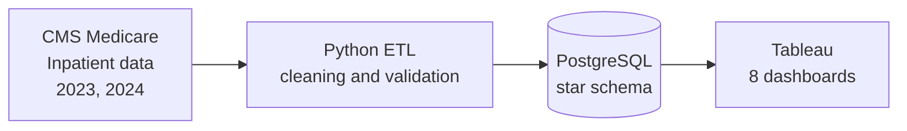
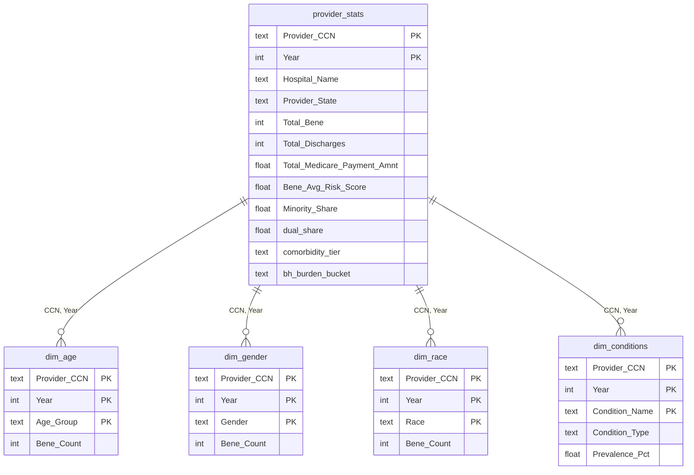

# Medicare Inpatient Payment Analysis

An end-to-end analytics project that uses CMS data to examine how Medicare inpatient payments vary across hospitals, states, and patient populations.

**Data:** CMS Medicare Inpatient Hospitals by Provider, 2023 and 2024
**Stack:** Python (ETL), PostgreSQL (star schema), Tableau (8 dashboards)

## Business Questions

| # | Question |
|---|----------|
| Q1 | How does payment per discharge vary across regions? |
| Q2 | Do minority-serving hospitals receive lower Medicare payments? |
| Q3 | Which chronic condition burden levels drive the highest Medicare expenditure? |
| Q4 | What is the charge-to-payment markup ratio across US hospitals? |
| Q5 | How do behavioral health comorbidities affect inpatient utilization? |
| Q6 | How do beneficiary age and gender composition affect payment and length of stay? |
| Q7 | Does HCC risk score predict hospital-level Medicare payments? |
| Q8 | Are high dual-eligible hospitals underpaid relative to risk-adjusted expectations? |


## Key Findings

- **Minority-serving hospitals are not paid less.** Hospitals with ≥50% minority share average $24,205 per beneficiary vs. $16,129 for low-minority hospitals. The gap persists within metro hospitals ($25,220 vs. $16,926) and shrinks by about half after controlling for state, urban/rural status, risk score, and dual-eligible share (regression estimate: +$3,927, 95% CI $2,326 to $5,527). Urban concentration therefore explains only part of the gap.
- **High dual-eligible hospitals are paid slightly more per discharge** ($13,555 vs. $12,436; median gap about $630). The gap is concentrated in metro hospitals (+$2,340) and reverses in non-metro hospitals (-$530), because high-dual hospitals are disproportionately non-metro. A regression controlling for state, urban/rural status, specialty status, minority share, and comorbidity index estimates +$442 per discharge (95% CI $79 to $805), so the effect is real but small. Urban concentration does not explain the raw gap. An interaction model could test whether the effect truly differs by setting.
- **Low-comorbidity hospitals are paid more per discharge than high-burden ones** ($14,512 vs. $12,129). Excluding specialty-type hospitals (flagged by name) shrinks the gap only slightly ($14,094 vs. $11,959), and a regression controlling for state, urban/rural status, specialty status, dual-eligible share, and minority share still estimates +$1,819 (95% CI $1,257 to $2,380). Specialty hospitals are therefore not the main driver. Payment per discharge is not case-mix adjusted, which may explain part of the remaining gap.
## Architecture



## Setup and How to Run
### Quick start (Docker)

Prerequisite: Docker Desktop.

```bash
cp .env.example .env          # then set DB_PASSWORD in .env
docker compose up --build
```

This starts PostgreSQL (exposed on `localhost:5433`) and runs the ingestion container, which pulls the 2023 and 2024 CMS inpatient files from the CMS Data API into the `raw_inpatient_provider` table. The ingestion is idempotent: re-running it replaces each year's rows instead of duplicating them.

The cleaned star schema is built separately by the ETL notebook (see below), which reads the same database.

### Prerequisites
- Python 3.10+
- PostgreSQL 14+ running locally on port 5432
- Tableau Desktop or Tableau Public (only needed to open the dashboards)

### 1. Get the data
Download **Medicare Inpatient Hospitals - by Provider** (2023 and 2024) from the
[CMS Data portal](https://data.cms.gov/) and place it so the folder layout is:

```
Data/
└── Medicare Inpatient Hospitals - by Provider/
    ├── 2023/*.CSV
    └── 2024/*.CSV
```

### 2. Install dependencies
```bash
python -m venv venv
source venv/Scripts/activate      # Git Bash on Windows
pip install -r requirements.txt
```

### 3. Configure the database
Create the database, then add your credentials to a `.env` file in the project root (see `.env.example`):
```bash
createdb -U postgres cms_project
```
```
DB_PASSWORD=your_postgres_password
```

### 4. Run the pipeline
Open `notebooks/ETL_Pipeline.ipynb` and run all cells. The Load step drops and
recreates the tables, so it is safe to re-run.

### Output
| Table | Description |
|-------|-------------|
| `provider_stats` | Fact table, one row per hospital per year |
| `dim_age`, `dim_gender`, `dim_race` | Beneficiary demographics (long format) |
| `dim_conditions` | Chronic condition prevalence, tagged Physical or Behavioral |

## Schema

The PostgreSQL database (`cms_project`) uses a star-style design. `provider_stats` is the central table, with one row per hospital per year. The four dimension tables hold long-format breakdowns and join back on `(Provider_CCN, Year)`.



**Design notes**
- The composite key `(Provider_CCN, Year)` allows year-over-year comparison per hospital.
- Demographics and conditions are stored in long format, so a new category needs no schema change.
- Foreign keys use `ON DELETE CASCADE` to keep the tables consistent on reload.

## Dashboards

**[View the interactive dashboards on Tableau Public](https://public.tableau.com/views/Cms_Medicare_Analysis_Poject/Dashboard1)**